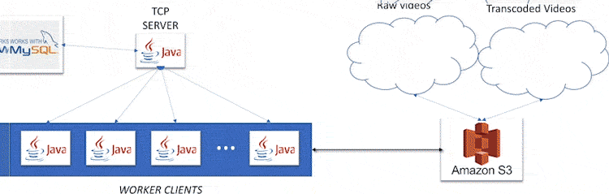
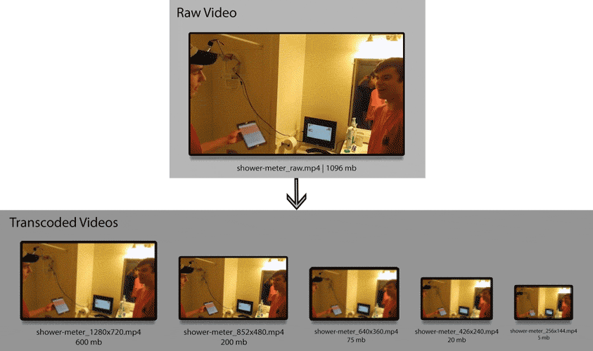

# Table of Contents
1. [Description](#description)
2. [Motivation](#motivation)
3. [How it Works](#how-it-works)
4. [Limitations](#limitations)
5. [From Now On](#from-now-on)



---
*animation showing the flow of the application. There are more jobs in `mysql` and those jobs would be distrubted to more clients I just did not want to keep animating them all*


<a name="description"></a>
# Description

This project shows how a website can increase video encoding throughput by distributing encoding jobs. 

<a name="motivation"></a>
# Motivation

When you upload a video to YouTube, that video immediately goes into the `processing` state.  During this state your `raw` video is *transcoded* into many different resolutions and *codecs*.  Since you can watch YouTube videos on numerus devices (smart tv, phone, computer, etc), its naive to think that you’re watching the exact video file that you uploaded. In fact, you’re watching the transcoded version of that video that works best with your device and network connection.


*The above video can be found at [https://www.youtube.com/watch?v=CdOYwmmzlcA&t=21s](https://www.youtube.com/watch?v=CdOYwmmzlcA&t=21s)*

<a name="how-it-works"></a>
# How it Works

* A client polls the TCP server for a JOB.
The `TCP server` fetchs the first job where 

```sql
SELECT * FROM job WHERE complete=0 AND inprogress=0

```
* The clients job is to download that file from s3 to the local disk and then perform the transcode using the parameters indicated by columns `width`,`height`,`crf`, and `audiobitrate`.

The `oldvideofilename` column indicates the name of the `raw video` file that is stored in the s3 bucket.

* The client then uploads the *transcoded* file to the s3 bucket using the `newvideofilename`.
* The client then reports back to the TCP server in which `complete` is set to `1` for that specific job.

|id |videoid|uploadid|oldvideofilename|newvideofilename    |width |height |crf|audiobitrate|inprogress|complete|workersignature  |
|---|------:|-------:|---------------:|-------------------:|-----:|------:|---|-----------:|---------:|-------:|-----------------|
|11 |1      |1       |shower_raw.mp4  |shower_1280x720.mp4 |1920  |1080   |24 |128000      |0         |1       |haera            |
|12 |1      |1       |shower_raw.mp4  |shower_852x480.mp4  |1280  |720    |24 |128000      |1         |0       |schuffs          |
|13 |1      |1       |shower_raw.mp4  |shower_640x360.mp4  |640   |360    |24 |128000      |1         |0       |espo             |
|14 |1      |1       |shower_raw.mp4  |shower_426x240.mp4  |426   |240    |24 |128000      |0         |0       |                 |
|15 |1      |1       |shower_raw.mp4  |shower_256x144xmp4  |256   |144    |24 |128000      |0         |0       |                 |

### sql for `job` table

```sql
CREATE TABLE `job` (
  `id` int(11) unsigned NOT NULL AUTO_INCREMENT,
  `videoid` int(11) unsigned NOT NULL,
  `uploadid` int(11) unsigned NOT NULL,
  `oldvideofilename` varchar(255) NOT NULL DEFAULT '',
  `newvideofilename` varchar(255) NOT NULL DEFAULT '',
  `width` int(11) NOT NULL,
  `height` int(11) NOT NULL,
  `crf` int(11) NOT NULL,
  `audiobitrate` int(11) NOT NULL,
  `inprogress` tinyint(1) NOT NULL DEFAULT '0',
  `complete` tinyint(1) NOT NULL DEFAULT '0',
  `workersignature` varchar(255) DEFAULT '',
  PRIMARY KEY (`id`)
) ENGINE=InnoDB AUTO_INCREMENT=18 DEFAULT CHARSET=utf8;
```
# Amazon s3 notes

1. create a bucket
2. create a IAM user
3. add s3 fullaccess policy to user


## Video Encoding and Transcoding

Done using the command line utility [FFMPEG](https://www.ffmpeg.org). A java wrapper was used which can be found [https://github.com/bramp/ffmpeg-cli-wrapper](https://github.com/bramp/ffmpeg-cli-wrapper)

## AMAZON S3 for java notes

1.  create a file called `credentials` in the directory `~/.aws/`
```
# Move this credentials file to (~/.aws/credentials)
# after you fill in your access and secret keys in the default profile
# WARNING: To avoid accidental leakage of your credentials,
#          DO NOT keep this file in your source directory.
[default]
aws_access_key_id=
aws_secret_access_key=
```

2. in java code 
```java
    AWSCredentials credentials = = new ProfileCredentialsProvider().getCredentials(); //credentials are soucred from ~./aws/credentials;

    AmazonS3 s3Client = new AmazonS3Client(credentials);

    List<Bucket> buckets = s3Client.listBuckets();

    for(Bucket bucket : buckets)
        System.out.println(bucket.getName());
```

# Usage

**Server**
```
Usage: java Server port mysql-address db-name user pass
                        [port] : Port number you want to run on,
                                 Make sure it is open on your firewall
               [mysql-address] : the ip address to the mysql db
                     [db-name] : the name of the database
                        [user] : the username for mysql
                        [pass] : the password for mysql
```

**Client**
```
Usage: java Client hostname port workername ffmpeg ffprobe
                [hostname] : of tcp server
                    [port] : of tcp server
                  [bucket] : bucket name of s3
              [workername] : name you want to call your worker
                  [ffmpeg] : path to ffmpeg
                 [ffprobe] : path to ffprobe
```

<a name="limitations"></a>

# Limitations

It only works with .mp4 h264 files (the way I programmed is hardcoded)

Only one bucket/folder is used on s3 so no two file names can be the same

<a name="from-now-on"></a>

# From Now On

If I were to continue adding to this project I would do the following

* Transcode videos to the mpeg-dash standard
* Programitcally create and destroy digital ocean droplet (clients) based on the quantity of jobs in table. (pub/sub)?
* Investigate pub sub so client doesnt have to continually poll server
* Investigate mysql table locks for mutual exclusion so we dont need a server (master slave architecture)

